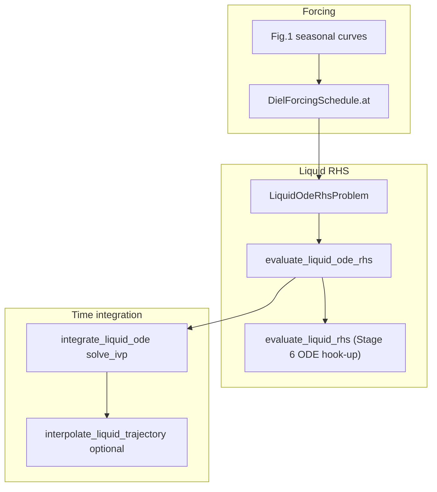

# Simulator architecture (ALBA liquid path)

This document describes how the **lumped liquid simulation** is wired in this repository: from **environmental forcing** and **reactor configuration** through the **liquid-phase RHS** that evaluates **ALBA biogeochemical process rates** and assembles **dC/dt** (implementation **Stage 6 — ODE hook-up** in the phased Hydrochemistry/simulator plan in [`development/DEVLOG.md`](development/DEVLOG.md)), optional **CSTR dilution**, and **time integration**.

## Scope

- **In scope here:** SI **17-component** liquid state, liquid RHS **`evaluate_liquid_rhs`** (Stage 6 — rates placed in **dC/dt** after Stages 1–5), ODE wrapper **`evaluate_liquid_ode_rhs`**, optional **Beer–Lambert** depth-averaged PAR when **`mixed_layer_depth_m`** is set ([`simulator/beer_lambert.py`](../src/bioprocess_twin/simulator/beer_lambert.py)), optional CSTR transport, diel forcing (`DielForcingSchedule`), and **`solve_ivp`** integration in [`src/bioprocess_twin/core/simulation.py`](../src/bioprocess_twin/core/simulation.py).
- **Related but separate:** [`startup_batch`](../src/bioprocess_twin/simulator/startup_batch.py) augments state with **volume** and rain/evaporation (open-pond balance); full coupling with continuous-flow HRAP is future work per sprint notes.

## Data flow (high level)

## Key modules and responsibilities

| Piece | Location | Role |
|-------|----------|------|
| State layout | [`core/state.py`](../src/bioprocess_twin/core/state.py) | `StateVector` SI components |
| Diel drivers | [`forcing/diel_forcing_schedule.py`](../src/bioprocess_twin/forcing/diel_forcing_schedule.py) | $T(t)$, $I_0(t)$, optional $Q$, etc.; clock wraps modulo 24 h |
| Light attenuation | [`simulator/beer_lambert.py`](../src/bioprocess_twin/simulator/beer_lambert.py) | Optional depth-averaged $\bar{I}$ from $I_0$, $\varepsilon$, $X_{ALG}$, mixed depth $h$; TSS proxy $X_{ALG}/1.57$ (SI 1.2) for documentation |
| Liquid RHS (`evaluate_liquid_rhs`) | [`simulator/liquid_rhs.py`](../src/bioprocess_twin/simulator/liquid_rhs.py) | **Stage 6 — ODE hook-up:** ALBA process rates → $d\mathbf{C}/dt$; nested **pH** closure (Stages 1–5 upstream) |
| ODE wrapper + CSTR | [`simulator/liquid_ode_rhs.py`](../src/bioprocess_twin/simulator/liquid_ode_rhs.py) | `LiquidOdeRhsProblem`, `evaluate_liquid_ode_rhs`, optional dilution |
| Pure dilution algebra | [`simulator/cstr_transport.py`](../src/bioprocess_twin/simulator/cstr_transport.py) | $(Q/V)(\mathbf{y}_\mathrm{in}-\mathbf{y})$ |
| **Integrator** | [`core/simulation.py`](../src/bioprocess_twin/core/simulation.py) | Hours-based `solve_ivp`; rates **÷24** (day⁻¹ → hour⁻¹) |
| Startup batch | [`simulator/startup_batch.py`](../src/bioprocess_twin/simulator/startup_batch.py) | 17 states + volume ODE; same **÷24** convention |

## Units and time bases

- **Integration clock:** `integrate_liquid_ode` uses **elapsed time in hours**. Forcing samples use **`problem.schedule.at(t_hours)`**, which maps to a repeating **daily** cycle internally.
- **Kinetic rates:** `evaluate_liquid_ode_rhs` returns derivatives in **g m⁻³ d⁻¹**; `simulation.integrate_liquid_ode` divides by **24** so `solve_ivp` derivatives are **per hour**, consistent with [`startup_batch.run_startup_batch`](../src/bioprocess_twin/simulator/startup_batch.py).

## Dense output and post-processing

- When **`dense_output=True`** and **`return_ode_result=True`**, SciPy keeps **`ode_result.sol`**, a piecewise interpolant over the solved interval.
- Use **`interpolate_liquid_trajectory(result, t_hours)`** to sample states at arbitrary query times within **`[sol.t_min, sol.t_max]`** without re-running the integrator.
- Derived quantities (process rates, detailed env diagnostics) are **not** stored automatically; compute them by evaluating **`evaluate_liquid_rhs`** / schedules at $(t, \mathbf{y})$ after interpolation if needed.

## Design decisions (phase1-04d)

- **ODE-sized driver:** the integrator advances **17** differential variables; **pH** remains an algebraic closure inside the liquid RHS assembly (**DAE index-1** reduction), mirroring the Casagli et al. / AQUASIM–style formulation described in sprint text. No separate DAE solver API in this phase.
- **Optional SciPy handle:** `return_ode_result` avoids retaining heavy objects unless debugging or dense sampling is required.
- **`first_step`:** optional hint (hours) forwarded to `solve_ivp` for stiff startups without changing default integration behavior when unset.

## Troubleshooting

Synchronized with the module docstring in [`simulation.py`](../src/bioprocess_twin/core/simulation.py); refine as the model hardens.

| Symptom | Things to try |
|---------|----------------|
| `success=False` or suspicious `message` | Read SciPy message; if `ode_result` attached, inspect it |
| `NaN` / `Inf` during integration | Evaluate `evaluate_liquid_ode_rhs(t0, y0, problem)` manually; check nonnegative clipping |
| Step / stiffness warnings | Lower `max_step` (hours); try `method="BDF"`; set `first_step` small |
| Too loose / tight accuracy | Adjust `rtol`/`atol` deliberately (see SciPy semantics) |
| Forcing glitches at day boundaries | Remember 24 h wrap; inspect callable schedules |
